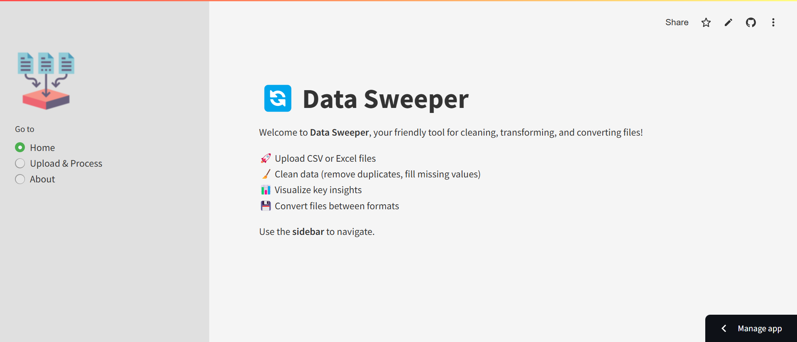
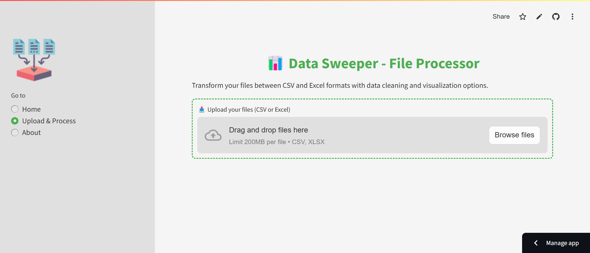
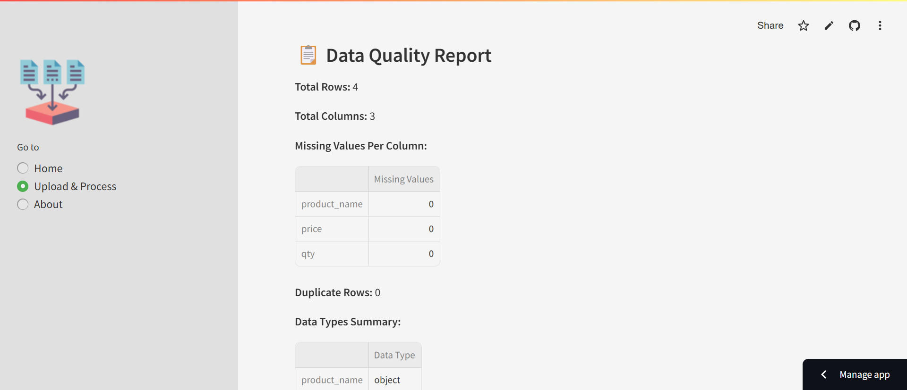
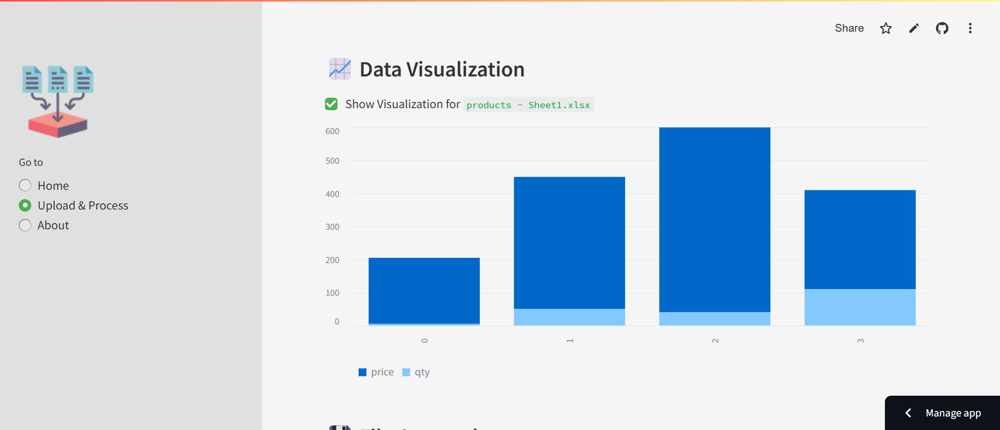

# 📊 Data Sweeper - File Cleaning & Conversion App

Welcome to **Data Sweeper**, an innovative **data transformation tool** built using [Streamlit](https://streamlit.io/). This app allows you to:

✅ Upload **CSV** or **Excel** files  
✅ Clean your data by removing duplicates and filling missing values  
✅ Preview your dataset directly in the app  
✅ Get a **Data Quality Report** with statistics, missing values, duplicates, and data types  
✅ Visualize key columns using interactive bar charts  
✅ Convert files between **CSV** and **Excel** formats  
✅ Download the cleaned and transformed file easily

---

## 🚀 Features

| Feature                        | Description |
|----------------------------------|-------------|
| 📂 File Upload                  | Upload multiple CSV/Excel files at once |
| 🧹 Data Cleaning                 | Remove duplicates, fill missing values |
| 📊 Data Quality Report           | Analyze missing values, duplicates, column types |
| 📈 Visualization                  | Quick bar charts for numeric columns |
| 💾 Format Conversion             | Convert between CSV and Excel |
| 🔄 Multi-file Processing         | Process several files in one go |
| 🎨 Styled UI                     | Custom CSS for improved appearance |
| 🧭 Sidebar Navigation            | Easy navigation between pages |
| 📥 Download                      | Download cleaned files directly from the app |

---

## 🖥️ Screenshots

### Home Page
The landing page that introduces the app.

### Upload & Process Page
Upload files, see Data Quality Reports, clean data, and convert files.

### Data Quality Report
Automatic analysis of missing data, duplicates, and column types.

### Data Visualization
Quickly view bar charts for numeric columns.

---

